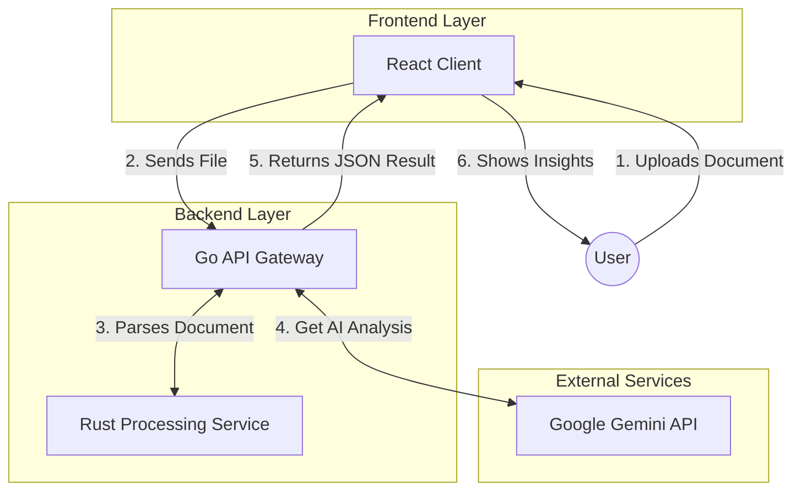

# LegalEase AI

LegalEase AI is a web application that transforms complex legal documents into clear, actionable insights using advanced AI. It provides instant risk assessment, plain English summaries, and expert recommendations for contracts, leases, employment agreements, and more.


##  Demo Video  
GitHub does not support inline playback of `.mp4` files directly inside a README.  
You can **view or download the demo video** from this repository here:  

 [**explanation-hackathon.mp4**](https://github.com/Hackb07/Legel-Ease/blob/main/explanation-hackathon.mp4?raw=true)  

*(Clicking this link will either open or download the video, depending on your browser settings.)*


##  Features  
- **AI-Powered Legal Analysis**: Analyze legal documents with Google's Gemini AI.  
- **PDF Upload**: Upload and parse PDF documents for instant analysis.  
- **Plain English Summaries**: Get easy-to-understand explanations of legal terms and obligations.  
- **Risk Assessment**: Identify and prioritize legal and financial risks.  
- **Actionable Recommendations**: Receive negotiation points and questions to ask before signing.  
- **Sample Document**: Try the app with a built-in sample lease agreement.

##  System Architecture

LegalEase AI employs a high-performance hybrid architecture to ensure secure and efficient document processing:



- **Frontend**: React + TypeScript (SPA) for a responsive user interface.
- **API Gateway (Go)**: Handles request orchestration, authentication, and business logic using Golang.
- **Processing Engine (Rust)**: dedicated microservice using Rust for high-fidelity, high-performance structured data extraction (PDF/OCR).  


## 🚀 How to Use  
1. Add your Gemini API key to a `.env` file:  
   ```env
   VITE_GEMINI_API_KEY=your_api_key_here


2. Install dependencies:

   ```bash
   npm install
   ```
3. Start the development server:

   ```bash
   npm run dev
   ```
4. Open the app in your browser, upload a PDF or paste your document text.
5. Click **Analyze Document** to get instant results.


## 🛠 Development

## 🛠 Development

* **Frontend**: Built with **React**, **TypeScript**, **Tailwind CSS**, and **Lucide React** icons.
* **Backend API**: **Go (Golang)** for robust API management and orchestration.
* **Data Processing**: **Rust** for performance-critical document parsing and OCR tasks.
* **AI Integration**: **Google Gemini** for advanced natural language understanding.
* PDF parsing powered by [pdfjs-dist](https://github.com/mozilla/pdf.js).
* Works with **Vite** for fast development and hot module replacement.


## 🧰 Project Structure

```
LegalEase/
├─ backend/
│  ├─ api-gateway/ (Go)
│  └─ processor/ (Rust)
├─ frontend/
│  ├─ public/
│  ├─ src/
│  ├─ components/
│  ├─ pages/
│  ├─ styles/
│  └─ utils/
├─ .env.example
├─ explanation-hackathon.mp4
├─ package.json
└─ README.md
```


## 🧪 Testing

Run tests using:

```bash
npm test
```


## 🧾 License

This project is licensed under the MIT License. See the [LICENSE](LICENSE) file for details.


## ⚠️ Disclaimer

This app provides educational analysis and **does not constitute legal advice**.
For binding legal guidance, consult a qualified attorney.


