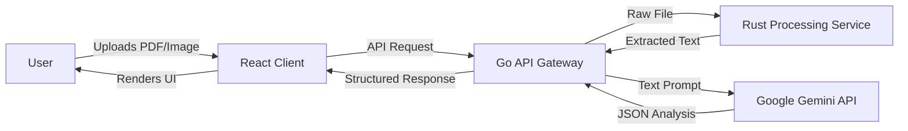

# LegalEase AI - Technical Design Document

## 1. System Architecture
LegalEase AI utilizes a modern, hybrid architecture combining a responsive React frontend with a high-performance backend infrastructure. The system is designed for scalability and speed, leveraging proper separation of concerns.

- **Frontend**: React + TypeScript (SPA) for the user interface.
- **Backend API**: Go (Golang) for the main API gateway, business logic, and orchestration.
- **Processing Engine**: Rust for compute-intensive tasks like high-fidelity PDF parsing and OCR.

### High-Level Diagram

## 2. Component Architecture

### 2.1 Core Components
- **App.tsx**: The main container component. Manages global state (active tab, document text, analysis results, loading states) and orchestrates the flow between upload and analysis views.
- **ApiKeySetup.tsx**: A modal/view that forces the user to input a valid Gemini API key before accessing the main app. Handles validation and local storage persistence.
- **AnalysisSection**: A reusable card component for displaying different sections of the analysis (Executive Summary, Risks, etc.).
- **RiskBadge**: A visual component to display risk levels (High/Medium/Low) with consistent styling and icons.
- **DetailedClause**: An interactive component for individual document clauses, supporting expansion to show detailed content.
- **FeatureCard**: Used on the landing/upload screen to showcase application features.

### 2.2 Backend Architecture

#### API Gateway / Orchestration (Go)
The core backend service is built with Go (e.g., Gin or Fiber framework). It handles:
- **Request Management**: Validating incoming requests and API keys.
- **Orchestration**: Coordinating between the frontend, the Rust processing service, and the Gemini API.
- **Business Logic**: Formatting prompts, cleaning data, and managing response structures.
- **Concurrency**: efficiently handling multiple simultaneous analysis requests.

#### Document Processing Service (Rust)
A dedicated microservice built with Rust (using frameworks like Actix-web or Axum). It is responsible for:
- **PDF Parsing**: Utilizing crates like `lopdf` or binding to `poppler` for high-fidelity text extraction.
- **OCR**: Integrated high-speed OCR (e.g., using `tesseract-rs`) for image-based documents.
- **Performance**: Ensuring minimal latency during the heavy extraction phase.

### 2.3 Services (`src/services/` - Frontend)
- **geminiService.ts**:
    - **`analyzeDocument(text: string)`**: Refactored to call the Go Backend API instead of Gemini directly.
    - **`DocumentAnalysis` Interface**: Defines the TypeScript interface for the structured AI response.

### 2.4 Utilities
- **PDF Extraction**: Implemented using `pdfjs-dist`. Utilizes a web worker to prevent blocking the main thread during parsing of large documents.
- **OCR (Optical Character Recognition)**: Implemented using `tesseract.js` for handling image uploads.
- **Icons**: `lucide-react` library is used for consistent, crisp iconography.

## 3. Data Flow

1.  **Input Phase**:
    - User selects a file.
    - Frontend sends the raw file (PDF or Image) to the Go API Gateway.

2.  **Processing Phase**:
    - Go Gateway validates the request and forwards the file to the **Rust Processing Service**.
    - Rust Service parses the PDF/Image, extracts text using high-performance libraries, and returns clean text to Go Gateway.

3.  **Analysis Phase**:
    - Go Gateway constructs the prompt and calls **Google Gemini API**.
    - Gemini returns the JSON analysis.
    - Go Gateway processes/sanitizes the JSON and sends it back to the Frontend.

4.  **Visualization Phase**:
    - `activeTab` switches to 'analysis'.
    - Components render data received from the backend response.

## 4. UI/UX Design System
- **Framework**: Tailwind CSS.
- **Color Palette**:
    - **Primary**: Blue/Indigo gradients (Trust, Professionalism).
    - **Risk Indicators**: Red (High), Amber (Medium), Emerald (Low).
    - **Backgrounds**: Soft gradients/glassmorphism (backdrop-blur) for a modern, high-end feel.
- **Typography**: Sans-serif, clean fonts for readability of dense legal text.
- **Animations**: Subtle fade-ins and expansions for smoother transitions (using Tailwind utility classes).

## 5. Security & Privacy
- **API Keys**: Managed securely on the Go backend; users authenticate via secure sessions.
- **Data Transmission**: All analysis happens server-side. Documents are processed in-memory by the Rust/Go services and are not persisted to disk.
- **Encryption**: TLS for all data in transit between Client, Backend, and AI Provider.

## 6. Future Considerations
- **Export Options**: Ability to export the summary as PDF or Word.
- **History**: storing previous analyses locally (IndexedDB).
- **Multi-language Support**: Using Gemini's translation capabilities to support non-English documents.
